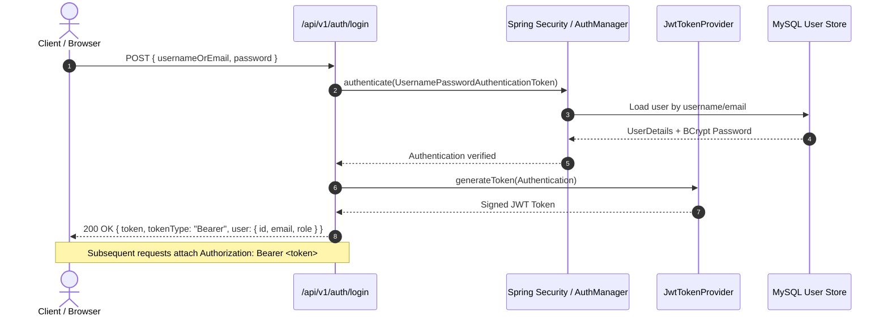

# CuraFlow System Architecture

## 1. System Overview

**CuraFlow** is a production-style, full-stack Hospital Management System (HMS) and Clinical Operations ERP built to unify administrative, clinical, pharmacy, diagnostic, and financial workflows into a coherent, high-reliability platform.

The system is designed around a **layered monolithic full-stack architecture** with a clear separation of concerns between:
- A high-performance, strongly typed **Spring Boot 3.x (Java 17)** REST API backend.
- A modern, responsive **React 18 + TypeScript** Single Page Application (SPA).
- A relational **MySQL 8** database managed via Spring Data JPA and Hibernate.

```mermaid
graph TD
    subgraph Client Tier
        UI[React 18 + TypeScript SPA]
        RTK[Redux Toolkit Store]
        AXIOS[Axios HTTP Client]
        UI --> RTK
        RTK --> AXIOS
    end

    subgraph API & Gateway Tier
        SEC[Spring Security + JWT Filter]
        CORS[CORS & Preflight Config]
        AXIOS -->|HTTPS / JSON REST| CORS
        CORS --> SEC
    end

    subgraph Backend Monolith com.curaflow
        CTRL[Controller Layer REST Endpoints]
        SRV[Service Layer Business Logic & Tx]
        REPO[Repository Layer Spring Data JPA]
        EX[Global Exception Handler]
        DTO[DTO & Jakarta Bean Validation]

        SEC --> CTRL
        CTRL --> DTO
        CTRL --> SRV
        SRV --> REPO
        CTRL -.-> EX
        SRV -.-> EX
    end

    subgraph Persistence Tier
        DB[(MySQL 8 Database)]
        HIB[Hibernate ORM / Connection Pool]
        REPO --> HIB
        HIB --> DB
    end
```



---

## 2. Technology Stack & Component Specifications

| Layer | Technology | Version | Key Responsibilities |
| :--- | :--- | :--- | :--- |
| **Backend Language** | Java | 17 LTS | Core server-side language; strongly typed OOP and concurrency. |
| **Backend Framework**| Spring Boot | 3.x | Monolith foundation, dependency injection, and autoconfiguration. |
| **API Architecture** | RESTful JSON | HTTP/1.1 | Standardized request/response envelopes, status codes, and DTO contracts. |
| **Security & Auth**  | Spring Security + JWT | 6.x | Stateless token authentication, BCrypt password hashing, role authorization. |
| **ORM / Persistence**| Spring Data JPA / Hibernate | 6.x | Relational object-relational mapping, transactional data operations. |
| **Input Validation** | Jakarta Bean Validation | 3.0 | API payload validation with descriptive failure messages. |
| **Database**         | MySQL | 8.0+ | Acid-compliant transactional storage with relational integrity. |
| **Frontend Framework**| React | 18.x | Declarative component-based UI rendering. |
| **Frontend Language** | TypeScript | 5.x | Strict type safety across components, state, and HTTP contracts. |
| **Build Tooling**    | Vite | Latest | High-speed frontend bundling and hot module replacement (HMR). |
| **Styling & Design** | Tailwind CSS + Mantine | Latest | Utility-first styling coupled with accessible clinical UI primitives. |
| **State Management** | Redux Toolkit | Latest | Centralized application state, caching, and authentication slice. |
| **HTTP Client**      | Axios | Latest | Configured HTTP client with request/response interceptors for JWT. |
| **Testing**          | JUnit 5, Mockito, Spring Boot Test | Latest | Comprehensive service logic unit tests and slice integration tests. |

---

## 3. Backend Package Architecture (`com.curaflow`)

The backend follows an industry-standard layered package architecture under the base package `com.curaflow`. Packages are organized strictly by functional responsibility:

```
backend/src/main/java/com/curaflow/
├── config/             # Spring configuration beans (Security, CORS, WebMvc, Auditing)
├── controller/         # REST API Controllers (request mapping, HTTP responses)
├── dto/                # Data Transfer Objects (Request/Response contracts, validation)
│   ├── request/        # Inbound request payloads
│   └── response/       # Outbound response models
├── entity/             # JPA Entities mapped to MySQL database tables
├── exception/          # Custom exceptions, error responses, and @ControllerAdvice
├── repository/         # Spring Data JPA interfaces for database operations
├── security/           # JWT filters, token providers, user details services
└── service/            # Business logic interfaces and transactional implementations
    └── impl/           # Concrete service implementations
```

### Architectural Principles & Boundaries
1. **Controller Layer**:
   - Thin controllers responsible only for HTTP method mapping, input validation via `@Valid`, and returning `ResponseEntity<T>`.
   - Never directly access JPA repositories or contain business algorithms.
2. **Service Layer**:
   - Houses all business rules, orchestration, cross-entity invariants, and transaction management (`@Transactional`).
   - Accepts and returns DTOs to avoid leaking managed entity states outside transactional boundaries.
3. **Repository Layer**:
   - Spring Data JPA repositories with derived queries and JPQL / native queries where indexing and performance necessitate.
4. **Entity Layer**:
   - Pure JPA entities with proper relational mappings (`@ManyToOne`, `@OneToMany`, `@JoinColumn`).
   - Audited with timestamps (`createdAt`, `updatedAt`) and soft-delete capabilities where auditability is clinically required.
5. **DTO Separation**:
   - Entities are NEVER directly serialized to REST clients to prevent unintended lazy-loading triggers, recursion, or accidental exposure of sensitive columns (e.g. passwords).

---

## 4. Frontend Architecture

The frontend is structured by feature modules and functional separation to support scalability and multi-role operations:

```
frontend/src/
├── assets/             # Static assets, branding, clinical icons
├── components/         # Reusable UI components
│   ├── common/         # Base atoms/molecules (Buttons, Modals, Badges, Loaders)
│   ├── forms/          # Standardized form inputs with validation feedback
│   ├── layout/         # Application shell, sidebar, topbar, navigation
│   └── tables/         # Data tables with sorting, filtering, and pagination
├── hooks/              # Custom React hooks (useAuth, usePagination, useDebounce)
├── pages/              # Routed view containers organized by clinical domain
│   ├── auth/           # Login, registration, password recovery
│   ├── admin/          # Admin control panel and department configuration
│   ├── doctor/         # Doctor appointment console, clinical note-taking
│   ├── staff/          # Nurse and triage intake dashboard
│   ├── pharmacist/     # Inventory dispensing and batch tracking
│   └── patient/        # Patient portal and record viewing
├── services/           # API integration layer with typed Axios methods
├── store/              # Redux Toolkit store slices (auth, notifications, UI)
├── types/              # TypeScript interface definitions mirroring backend DTOs
└── utils/              # Utility functions, date formatters, currency helpers
```

---

## 5. Security & Role-Based Access Control (RBAC)

CuraFlow implements stateless, token-based authentication using **Spring Security** and **JSON Web Tokens (JWT)**.

### User Roles
The platform defines 5 distinct system roles with strictly enforced boundaries:

1. `ROLE_ADMIN`:
   - Full governance over hospital master records, departments, doctor/staff profiles, room/bed allocations, and operational audits.
2. `ROLE_DOCTOR`:
   - Access to assigned appointments, patient clinical history, consultation diagnosis entry, prescriptions, and lab test ordering.
3. `ROLE_STAFF`:
   - Patient intake and check-in, vital signs recording, triage coordination, and room bed assignment assistance.
4. `ROLE_PHARMACIST`:
   - Medicine inventory management, batch and expiry date monitoring, and prescription fulfillment/dispensing.
5. `ROLE_PATIENT`:
   - Personal profile self-service, personal appointment booking and rescheduling, prescription review, and billing history.

### Authentication Flow


---

## 6. Design System & UI Specifications

The CuraFlow user interface adheres to a clean, high-contrast, clinical design palette ensuring readability, cognitive comfort, and accessibility:

| Token | Value | Semantic Usage |
| :--- | :--- | :--- |
| **Primary** | `#1fad9f` | Primary branding, action buttons, active navigation states. |
| **Primary Dark** | `#072c2b` | Deep contrast elements, header text, focused indicators. |
| **Light Background** | `#F0F3FB` | Application canvas, background surfaces, card containers. |
| **Dark Neutral** | `#212529` | High-contrast body text, primary typography. |
| **Neutral Surface** | `#f6f6f6` | Form input borders, dividers, subtle secondary backgrounds. |
| **Body Font** | `Poppins, sans-serif` | Clean, highly legible sans-serif for data tables and controls. |
| **Heading Font** | `Merriweather, serif` | Professional, authoritative typography for headers and reports. |

---

## 7. Database & Persistence Architecture

1. **Database Engine**: MySQL 8.0 with InnoDB storage engine.
2. **Character Set**: `utf8mb4` with `utf8mb4_unicode_ci` collation for multi-language support.
3. **Naming Conventions**:
   - Table names: `snake_case` in plural form (e.g. `users`, `departments`, `appointments`, `medical_records`).
   - Column names: `snake_case` (e.g. `first_name`, `created_at`, `doctor_id`).
   - Foreign Keys: `fk_<source_table>_<target_table>` (e.g. `fk_appointments_doctor_id`).
   - Indexes: `idx_<table_name>_<column_name>` for search and foreign key lookup optimization.
4. **Transactions**:
   - Declared at the service layer using `@Transactional`.
   - Read-only operations annotated with `@Transactional(readOnly = true)` for database engine optimization.

---

## 8. Development & Implementation Roadmap

The application is implemented in strictly isolated, testable, and commit-ready milestones:

- **Phase 1: Foundation (Milestones 1–5)**: Repository setup, backend & frontend scaffolding, MySQL & JPA configuration, core exception architecture.
- **Phase 2: Authentication & Authorization (Milestones 6–10)**: User entities, registration, JWT security filter, RBAC, frontend auth state & protected routes.
- **Phase 3: Core Hospital Administration (Milestones 11–15)**: Departments, doctors, staff, patients, appointment schedules.
- **Phase 4: Clinical Operations & Records (Milestones 16–18)**: Consultations, vitals, prescriptions, lab reports.
- **Phase 5: Resource Management (Milestones 19–22)**: Pharmacy inventory, blood bank, hospital equipment, rooms and beds.
- **Phase 6: Financials & Operations (Milestone 23)**: Invoicing, payment recording, and balance calculation.
- **Phase 7: User Experience & Dashboards (Milestones 24–31)**: OpenAPI docs, application shell, role dashboards, and full API integration.
- **Phase 8: Production Readiness (Milestones 32–36)**: Automated testing suite, security hardening, Dockerization, CI/CD, and final handover.
